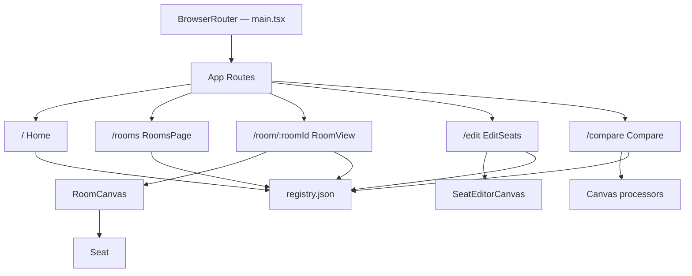
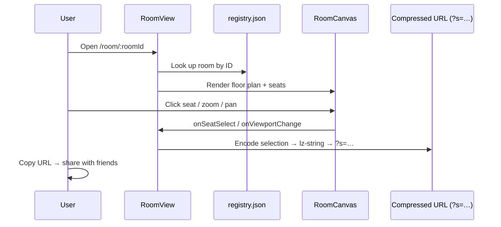

# SMU Seats

A Vite + React + TypeScript SPA that lets SMU students **browse classroom floor plans, click their seats, and share a URL** so friends know where they're sitting. Deployable as a static site on Vercel.

---

## Features

| Route | What it does |
| ----- | ------------ |
| `/` | Landing page — hero, how-it-works guide, building shortcut cards |
| `/rooms` | Filterable room browser (Building → Floor → Type) with shareable query params |
| `/room/:roomId` | Interactive seat map — click seats, zoom/pan, copy a shareable link |
| `/edit` | Contributor seat editor — add/move/delete/renumber seats, export JSON download (enabled in dev, or with `VITE_ENABLE_EDITOR=true`) |
| `/compare` | Visual comparison sandbox for image enhancement methods |

- Seat selections are compressed into the URL via **lz-string** so links are self-contained
- **registry.json** is the single source of truth for every room's image path, dimensions, and seat coordinates

---

## Project structure

```text
src/
  App.tsx                  # Root router — defines all client-side routes
  main.tsx                 # Entry point — mounts React inside BrowserRouter
  index.css                # All application styles (no CSS modules)
  pages/
    Home.tsx               # Landing page with hero + building cards
    RoomsPage.tsx          # Filterable room browser
    RoomView.tsx           # Interactive seat map viewer
    EditSeats.tsx          # Seat-position editor for contributors
  components/
    viewer/
      RoomCanvas.tsx       # Zoomable, pannable floor-plan canvas
      Seat.tsx             # Single interactive seat dot (React.memo)
    creator/
      SeatEditorCanvas.tsx # Editor canvas — click-to-place, drag-to-move
  hooks/
    useUrlState.ts         # Encodes/decodes seat selection in URL (?s=…)
  utils/
    roomMeta.ts            # Building config, display order, metadata parser
  data/
    registry.json          # Source of truth — rooms, images, seat coords
    registry.backup.json   # Backup copy of registry
scripts/
  refine-seats.mjs         # Auto-refine seat positions (learns from manual edits)
  detect-seats*.mjs        # Seat detection variants
  extract-capacity.mjs     # OCR extraction of seating capacity
  merge-seats.mjs          # Hybrid OCR + blob merge strategy
  mask-*.mjs               # Image masking and preprocessing utilities
  validate-registry.mjs    # Registry data shape validation
public/
  maps/                    # Floor-plan PNGs (one per room)
vercel.json                # SPA catch-all rewrite for Vercel deployment
```

---

## Getting started

```bash
# 1. Install dependencies
npm install

# 2. Start the dev server
npm run dev
```

Open the URL Vite prints in your terminal (usually `http://localhost:5173`).

### Build & preview

```bash
npm run lint      # ESLint check
npm run validate:registry   # Registry shape checks
npm run check     # lint + registry validation
npm run build     # TypeScript check, then production build → dist/
npm run preview   # Serve the built output locally
```

For the isolated sharing checks, install Python Playwright once with
`python -m pip install playwright==1.60.0` and `python -m playwright install chromium`,
then run `python tests/browser.py` after building. The script starts and closes its
own local static server, uses synthetic seat names, and blocks external requests.
CI runs the same suite on pull requests and application changes on main.

### Sharing and browser history

Selections remain in the existing compressed `?s=` URL format. Back/Forward follows
the current link, and redirects to the room encoded in a shared selection preserve
the full query and fragment. Names are visible to anyone with the link.

Share copies the complete current selection. When it exceeds the existing
1,800-character encoded-state limit, the app keeps the draft in the current tab,
shows a warning and disables Share. Shorten names or remove seats to make it
shareable; navigating away or reloading discards changes that could not fit in the
link. Clipboard denial shows a message and allows another attempt. Invalid or
oversized incoming selections are reported instead of silently appearing saved.

This app does not create Supabase records or poll a cloud service. Floor plans and
the seat registry remain bundled files; hosting and data migration are separate
portfolio maintenance work.

---

## Deploying to Vercel

The repo includes a `vercel.json` with a catch-all rewrite so all client-side routes (`/rooms`, `/room/:id`, `/edit`, etc.) resolve to `index.html` on direct refresh while static assets are served normally.

### Vercel project settings

| Setting | Value |
| ------- | ----- |
| Framework preset | **Vite** |
| Build command | `npm run build` |
| Output directory | `dist` |

### One-click deploy

1. Import the repo into Vercel
2. Keep the defaults above
3. Deploy

---

## Seat editor (`/edit`)

The built-in editor at `/edit` lets contributors adjust seat positions visually.
In production builds it is route-gated by default; enable with `VITE_ENABLE_EDITOR=true`:

```bash
VITE_ENABLE_EDITOR=true npm run dev
```

Editor capabilities:

- **Click** on the floor plan to place a new seat
- **Drag** an existing seat to reposition it
- **Delete button** or **Delete/Backspace** to remove a selected seat
- **Renumber** re-labels all seats sequentially
- **Clear All** removes every seat in the room
- **Undo** (Ctrl+Z) reverts the last action
- **Export JSON** downloads a complete `registry.json` file snapshot

### Auto-refinement script

`scripts/refine-seats.mjs` can automatically refine seat positions by learning from rooms you've already manually edited:

```bash
node scripts/refine-seats.mjs
```

It uses connected-component detection on the floor-plan PNGs, applies a 50 px merge distance to eliminate clusters, and skips rooms that already match their expected capacity.

### Script pipeline quick reference

```bash
# Generate PNGs from floorplan PDFs and sync registry dimensions
npm run extract:pdf

# Optional one-time conversion utility (preview by default; add --apply to write)
npm run convert:coords -- --apply

# Run seat detection
npm run detect:seats

# Refine detections with capacity-aware heuristics
node scripts/refine-seats.mjs

# Validate data shape before commit
npm run validate:registry
```

---

## Architecture

### Route / component flow



### Seat selection data flow



---

## Contributing

1. Fork the repo and create a feature branch
2. Run `npm run lint` before committing
3. If adding or editing seat positions, use the `/edit` page and export the JSON
4. Open a PR with a clear description of what changed

## License

Apache-2.0. See [LICENSE](LICENSE) and [NOTICE](NOTICE).
